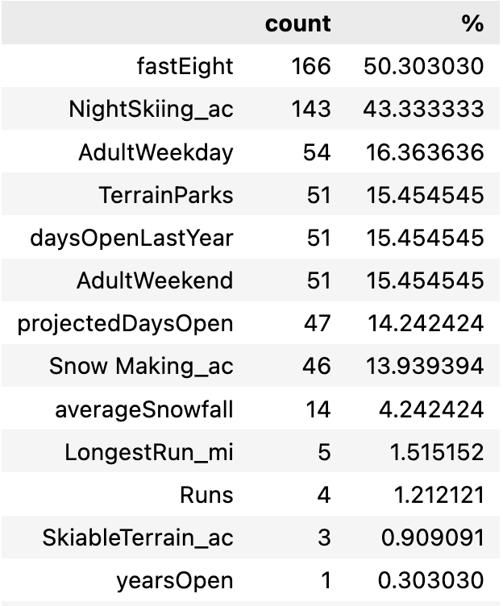

# Price Strategies for Resort Business

## Problem Statement

* Hypothesis:
How do we increase the revenue by 0.5% this year by either cutting the operational costs or increasing the ticket price? 

* Problem Context:
Big Mountain Resort is a ski resort located in Montana, which provides spectacular views and can accommodate skiers and riders with all levels and abilities. Recently, Big Mountain Resort installed an additional chair which increases the distribution of visitors across the mountain but increases the operating costs by $1,540,000 this season. The business asks for a better price strategy that either cuts costs without undermining the ticket price or supports an even higher ticket price.

[Full Statement](Supplementary/Problem Statement.pdf)

## Data Wrangling

1. The dataset contains 27 columns and 330 entries. 
2. Two types of ticket price exist, called AdultWeekday and AdultWeekend.
3. Missing Values

